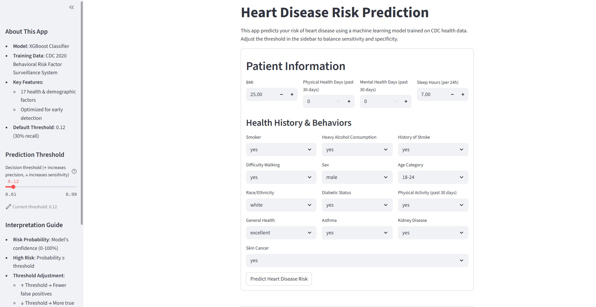
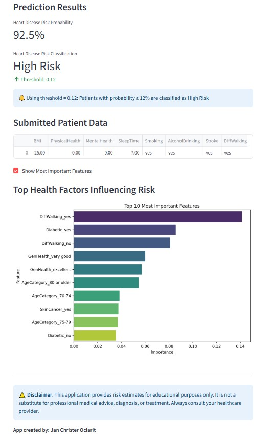

# 🫀 Heart Disease Risk Prediction App

This is a **machine learning-powered web application** that predicts a patient's risk of heart disease based on health and demographic data. It leverages CDC's 2020 Behavioral Risk Factor Surveillance System dataset and an optimized **XGBoost classifier**. The app provides real-time predictions and visualizations to support awareness and early risk screening.




---

## 🚀 Features

- ✅ Interactive web interface using **Streamlit**
- 🧠 Real-time **heart disease risk prediction**
- 🎛️ Adjustable **prediction threshold** (precision/recall tradeoff)
- 📊 Visual display of **feature importance**
- 🧹 Built-in data preprocessing: imputation, scaling, and encoding
- 💾 Saves model and metadata for deployment
- ⚠️ Clear disclaimer for **educational/non-diagnostic** usage

---

## 🧠 How It Works

1. **Data Cleaning**:

   - Column name formatting and value standardization
   - Missing value imputation for numeric and categorical columns
   - Lowercasing and whitespace stripping

2. **Model Training**:

   - Uses `XGBoostClassifier` with imbalance handling
   - Data pipeline created using `scikit-learn`'s `Pipeline` and `ColumnTransformer`
   - Optimized for recall (30%) to prioritize **early detection**

3. **App Interface**:
   - Accepts user input via Streamlit UI
   - Predicts probability and classifies based on a dynamic threshold
   - Displays result interpretation and top influential features

---

## 💻 How to Run Locally

### 1. Clone the repository

```bash
git clone https://github.com/JaysiOclarit/heart-disease-risk-predictor.git
cd heart-disease-risk-predictor
```

### 2. Install dependencies

#### Make sure Python 3.8+ is installed, then:

```
pip install -r requirements.txt
```

### 3. (Optional) Retrain the model

#### If you want to retrain the model using the raw dataset:

```
python train_model.py
```

#### Make sure data/heart_2020_uncleaned.csv exists.

### 4. Launch the app

```
streamlit run app/app.py
```

## 📓 Notebook

#### You can view the training and evaluation steps in the notebook below:

#### [Google Colab Notebook](https://colab.research.google.com/drive/13oR_n5WAPX31cKWt4t43nbnI1phWy4yw#scrollTo=dGIg-3-8wwBC)

## 📁 Project Structure

```
heart-disease-risk-predictor/
├── app/
│   └── app.py                     # Streamlit frontend app
├── data/
│   └── heart_2020_uncleaned.csv   # Raw dataset
├── model/
│   ├── best_heart_disease_model.joblib
│   ├── feature_metadata.json
├   └── train_model.py             # Data preprocessing & training pipeline
├── img/
│   ├── 1.png                      # App UI screenshot
│   └── 2.png                      # App UI screenshot
├── notebooks/
│   └── heart_disease_risk_predictor.ipynb
├── requirements.txt
└── README.md

```

## ⚠️ Disclaimer

#### This application is intended for educational and informational purposes only.

#### It is not a medical diagnostic tool. Always consult a licensed healthcare professional for medical concerns.

## 👨‍💻 Author

#### Jan Christer Oclarit

#### 📍 Davao City, Philippines

#### 🔗 GitHub: [JaysiOclarit](https://github.com/JaysiOclarit)
